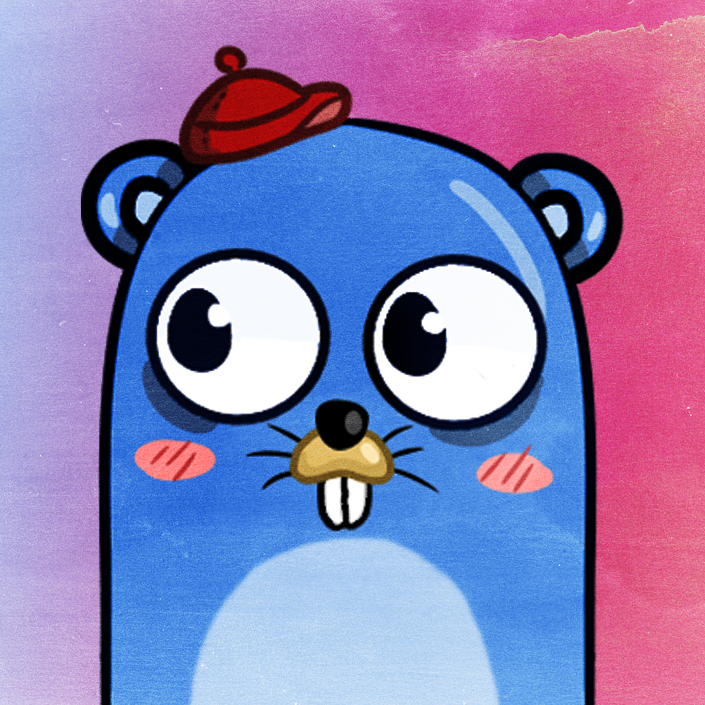

# What is Go Learning Land

Go Learning Land (GLL) is a non-profit organization that helps other people to learn and develop new skills in Golang. We are currently starting a project for ERC-721 Gopher NFTs in Ethereum mainnet. We are trying to build a non-toxic golang community for every skill level; each gopher will own a unique NFT for free.

